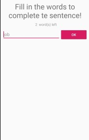
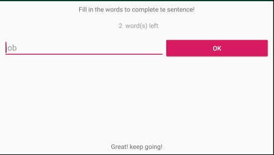
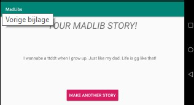

# Mad-libs

Ik heb een Mad-libs app gemaakt. Waarbij je uit vijf verschillende verhalen kan kiezen.
Dan doorverwezen wordt naar een nieuwe pagina en daar de missende woorden in kan vullen.

Dit doet het ook in land mode. 
Als je in de laatste pagina komt dan en je drukt op terug-pijltje dan gaat hij weer naar het beginscherm.

Ik heb ook het icon van de app veranderd.

